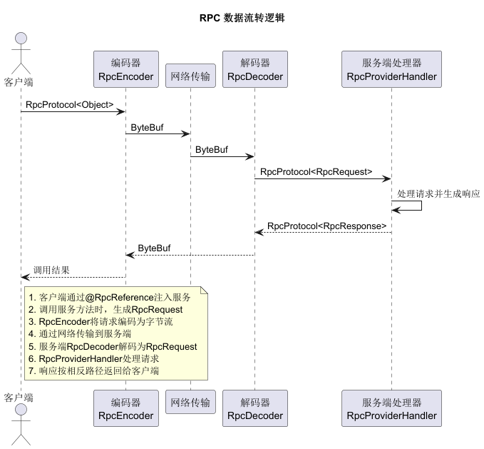
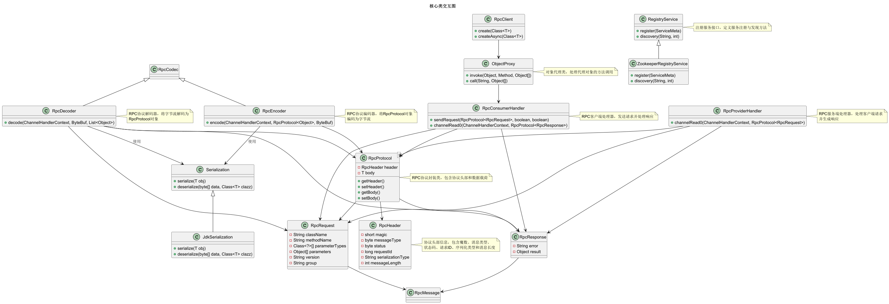

# HRPC - 高性能RPC框架

HRPC是一个基于Java开发的轻量级RPC框架，采用Netty作为通信层，支持多种序列化方式和动态代理技术。

## 项目结构

```
hrpc
├── hrpc-annotation      # 注解模块，包含服务提供者和消费者注解
├── hrpc-codec           # 编解码模块，处理RPC协议的编码和解码
├── hrpc-common          # 公共模块，包含工具类、异常类、扫描器等
├── hrpc-constants       # 常量模块，定义RPC框架中的各种常量
├── hrpc-consumer        # 服务消费者模块
│   ├── hrpc-consumer-common   # 消费者公共实现
│   └── hrpc-consumer-native   # 原生消费者实现
├── hrpc-protocol        # 协议模块，定义RPC通信协议和消息格式
├── hrpc-provider        # 服务提供者模块
│   ├── hrpc-provider-common   # 服务提供者公共实现
│   └── hrpc-provider-native   # 原生服务提供者实现
├── hrpc-proxy           # 代理模块
│   ├── hrpc-proxy-api     # 代理接口定义
│   └── hrpc-proxy-jdk     # JDK代理实现
├── hrpc-registry        # 注册中心模块
│   ├── hrpc-registry-api      # 注册中心接口定义
│   └── hrpc-registry-zookeeper# Zookeeper注册中心实现
└── hrpc-serialization   # 序列化模块
    ├── hrpc-serialization-api     # 序列化接口定义
    └── hrpc-serialization-jdk     # JDK原生序列化实现
```


## 核心特性

### 1. 多种序列化支持
- JDK原生序列化
- 后续可扩展支持Protostuff、Kryo、Hessian等高性能序列化方式

### 2. 多种动态代理支持
- JDK动态代理
- Cglib动态代理
- Javassist动态代理

### 3. 自定义RPC协议
协议格式：
```
+---------------------------------------------------------------+
| 魔数 2byte | 报文类型 1byte | 状态 1byte |     消息 ID 8byte      |
+---------------------------------------------------------------+
|           序列化类型 16byte      |        数据长度 4byte          |
+---------------------------------------------------------------+
|                             数据                              |
+---------------------------------------------------------------+
```

### 4. 注解驱动
- `@RpcService`：标记服务提供者
- `@RpcReference`：标记服务消费者

### 5. Netty通信
基于Netty的高性能NIO通信框架，支持高并发连接

### 6. 服务注册与发现
- 基于Zookeeper的服务注册与发现
- 支持服务分组和版本管理

### 7. 负载均衡
- 一致性Hash负载均衡策略

### 8. 异步调用支持
- 同步调用
- 异步调用
- 单向调用（Oneway）

## 模块详解

### hrpc-annotation
定义了核心注解：
- `@RpcService`：用于标记服务提供者实现类
- `@RpcReference`：用于标记服务消费者引用字段

### hrpc-codec
包含RPC协议的编解码器：
- `RpcEncoder`：将RPC消息编码为字节流
- `RpcDecoder`：将字节流解码为RPC消息

### hrpc-common
公共工具模块：
- 类扫描器：扫描指定包下的类
- 序列化工具：处理序列化相关操作
- 线程池：统一的线程池管理
- ID生成器：生成唯一请求ID

### hrpc-constants
定义RPC框架中使用的常量：
- 协议头长度
- 魔数
- 版本号
- 序列化类型常量
- 注册中心类型常量

### hrpc-consumer
服务消费者实现：
- `RpcConsumer`：RPC消费者，管理与服务提供者的连接
- `RpcConsumerHandler`：消费者消息处理器
- `RpcClient`：客户端入口，提供创建代理对象的接口

### hrpc-protocol
定义RPC协议相关类：
- `RpcProtocol`：RPC协议封装类
- `RpcHeader`：协议头
- `RpcRequest`：RPC请求
- `RpcResponse`：RPC响应
- `RpcType`：消息类型枚举
- `RpcStatus`：状态码枚举

### hrpc-provider
服务提供者实现：
- `BaseServer`：基础服务端实现
- `RpcProviderHandler`：服务端消息处理器
- `RpcSingleServer`：单机版服务端

### hrpc-proxy
代理模块：
- `ProxyFactory`：代理工厂接口
- `JdkProxyFactory`：JDK动态代理工厂实现
- `ObjectProxy`：对象代理，处理代理对象的方法调用
- `RPCFuture`：异步调用结果封装

### hrpc-registry
注册中心模块，实现服务的注册与发现：
- `RegistryService`：注册服务接口
- `ZookeeperRegistryService`：基于Zookeeper的注册服务实现
- 支持服务分组和版本管理
- 提供服务发现和负载均衡支持

## 使用示例

### 1. 定义服务接口
``java
public interface HelloService {
    String sayHello(String name);
}
```

### 2. 实现服务提供者
``java
@RpcService(interfaceClass = HelloService.class, version = "1.0.0", group = "default")
public class HelloServiceImpl implements HelloService {
    @Override
    public String sayHello(String name) {
        return "Hello, " + name;
    }
}
```

### 3. 启动服务提供者
``java
public class Server {
    public static void main(String[] args) {
        RpcSingleServer server = new RpcSingleServer("127.0.0.1", 27880, "zookeeper", "127.0.0.1:2181");
        server.scanServiceAndRegister("com.example.service.impl");
        server.start();
    }
}
```

### 4. 服务消费者引用
``java
public class Client {
    public static void main(String[] args) {
        RpcClient client = new RpcClient("127.0.0.1:2181", "zookeeper", "1.0.0", "default", "jdk", 5000, false, false);
        HelloService helloService = client.create(HelloService.class);
        String result = helloService.sayHello("World");
        System.out.println(result);
        client.shutdown();
    }
}
```

## 日志配置

框架使用Log4j作为日志框架，默认日志配置如下：

```
log4j.rootLogger=INFO, console, file

log4j.logger.com.rain.rpc=DEBUG
log4j.logger.com.rain.rpc.common.scanner=DEBUG

log4j.appender.console=org.apache.log4j.ConsoleAppender
log4j.appender.console.Target=System.out
log4j.appender.console.layout=org.apache.log4j.PatternLayout
log4j.appender.console.layout.ConversionPattern=%d{yyyy-MM-dd HH:mm:ss.SSS} [%t] %-5p %c{1}:%L - %m%n

log4j.appender.file=org.apache.log4j.DailyRollingFileAppender
log4j.appender.file.File=logs/hrpc.log
log4j.appender.file.DatePattern='.'yyyy-MM-dd
log4j.appender.file.layout=org.apache.log4j.PatternLayout
log4j.appender.file.layout.ConversionPattern=%d{yyyy-MM-dd HH:mm:ss.SSS} [%t] %-5p %c{1}:%L - %m%n
```

日志级别说明：
- ROOT级别为INFO，输出到控制台和文件
- com.rain.rpc包下的日志级别为DEBUG，便于调试
- 日志文件按天滚动，存储在logs目录下
- 错误日志单独存储在hrpc-error.log文件中

## 环境要求

- JDK 21+
- Maven 3.6+
- Zookeeper 3.8+（用于服务注册与发现）
- IDE推荐使用IntelliJ IDEA

## 项目构建

```bash
# 克隆项目
git clone <项目地址>

# 进入项目目录
cd hrpc

# 使用Maven构建项目
mvn clean install
```

## 技术栈

- 核心框架：Java 21
- 网络通信：Netty 4.2.6.Final
- 序列化：JDK原生序列化
- 日志框架：SLF4J + Log4j
- 注册中心：Apache Curator (Zookeeper)
- JSON处理：Fastjson 2.0.28
- 工具类：Apache Commons Lang3
- 单元测试：JUnit 5
- 依赖注入：Spring Context 6.2.0

## 数据流转图



## 核心类交互图



## 后续计划

1. 添加更多序列化方式支持（Protostuff、Kryo、Hessian等）
2. 实现更多负载均衡策略
3. 添加服务监控和管理功能
4. 提供Spring Boot Starter简化使用
5. 实现更多注册中心支持（Nacos、Etcd等）
6. 添加服务熔断和降级机制
7. 实现服务限流功能

## 许可证

MIT License
